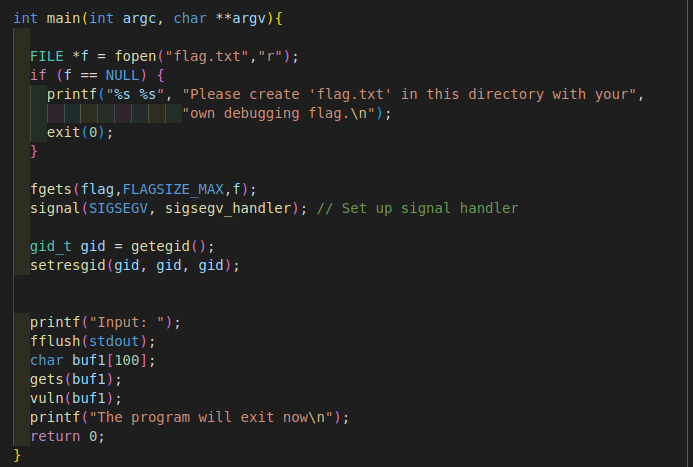
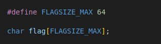
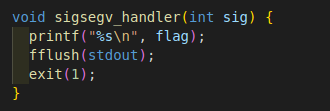
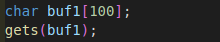
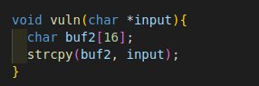
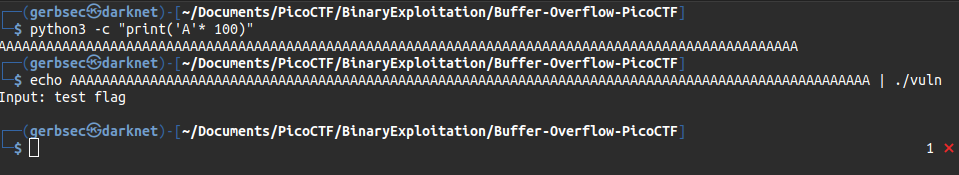
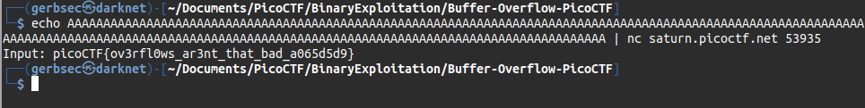

---
date: 7/22/2022
--- 

# Challenge name: Buffer Overflow 1

## Description

> Smash the stack

> Let's start off simple, can you overflow the correct buffer? 
> The program is available here. You can view source here. And connect with it using:

```bash
nc saturn.picoctf.net 53935
```

## Approach

My approach to these challenges are going to be very similiar. 

- Read source code
- Identify vulnerability
- Exploit Locally
- Exploit on remote server!
- Win!

Obviously there will be more steps to my methodology depending on the machine and 
vulnerability; however, that is the outline that I want to follow.

 Getting started

I like to start by looking at the main function. I do this because I like to follow the code flow of the app and that is defined in the main function.



I also keep in mind the global variables.



As we can see the app attempts to read a file called flag.txt and reads it into a variable. 

Next it sets up a signal with the `sigsegv_handler`, this is defined here:



This pretty much means that if a segfault happens in the app, it will print the flag variable and present us the flag. 

Next we seee the app is using `gets()` which is a very vulnerable function because there is no way for us to identify a buffer limit. 



This gets is pushing data into a 100 buffer variable. Then it passes that data to the `vuln()` function which looks like this: 



This is taking the 100 bytes or more that we give buf1 and passing it to a 16 byte buffer that will likely break and initiate a seg fault. 



As you can see passing 100 bytes to the binary triggers a seg fault and it will print the flag.

Finally over netcat:


