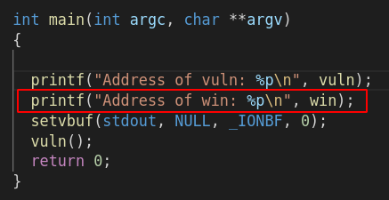
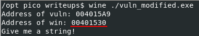
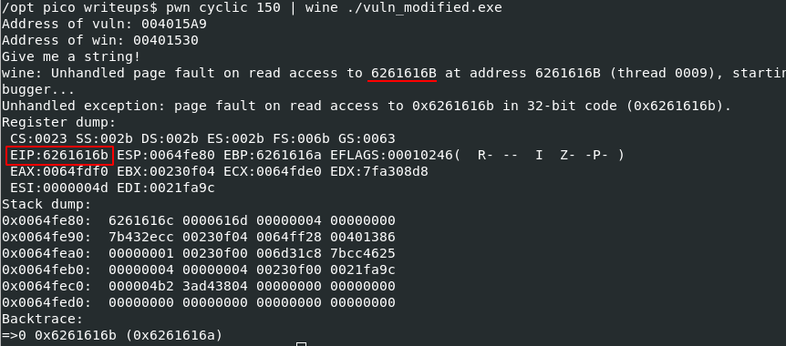
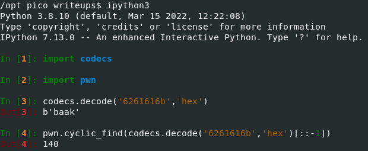
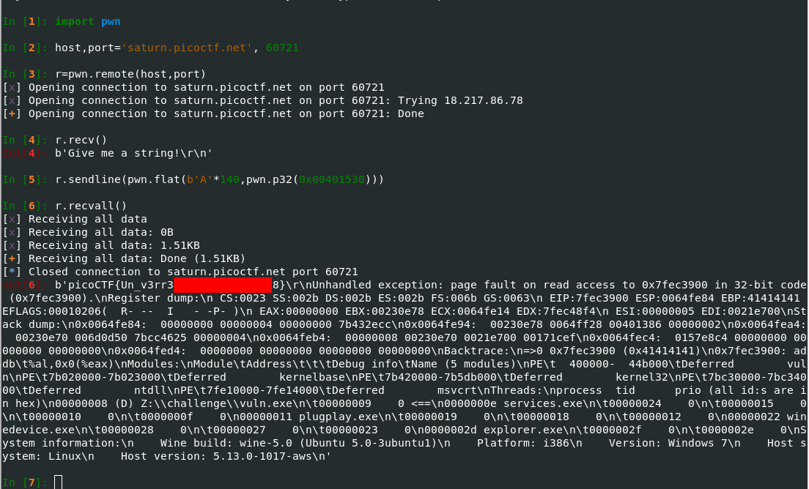
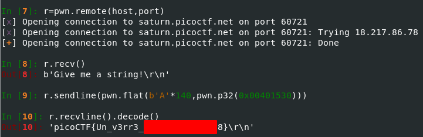

---
date: 7/3/2022
--- 

# Challenge name: wine

## Description

> Challenge best paired with wine.

> I love windows. 
> Checkout my [exe](./vuln.exe) running on a linux box. 
> You can view source [here](./vuln.c). 
> And connect with it using: 

```bash
nc saturn.picoctf.net 50631
```

## Hints

> Gets is dangerous. Even on windows.

## Approach

I'm sure there is a better way to do this challenge than my way but here is the "easy" way of doing it (no debugging, only using wine to run the exe).
Modify the source code to print the address of the `win` function.



Compile the [modified source code](./vuln-modified.c) using [mingw](https://www.mingw-w64.org/).
This is the command I used:

```bash
i686-w64-mingw32-gcc-win32 -m32 vuln-modified.c -o vuln_modified.exe -no-pie
```

Run the newly compiled [executable](./vuln_modified.exe) under wine to get the address of `win`.



Now we need to find the offset at which we can control EIP.
When you run the program under wine and cause a segfault it tells you right in the terminal what address it attempted to access.
I'll be using the pwn cyclic module to find the offset.
We know from the source code that the buffer is 128 bytes so I'll use a pattern of 150 characters.






All that's left is to append the `win` address and run it on the remote instance:



Or a little more cleaned up:




